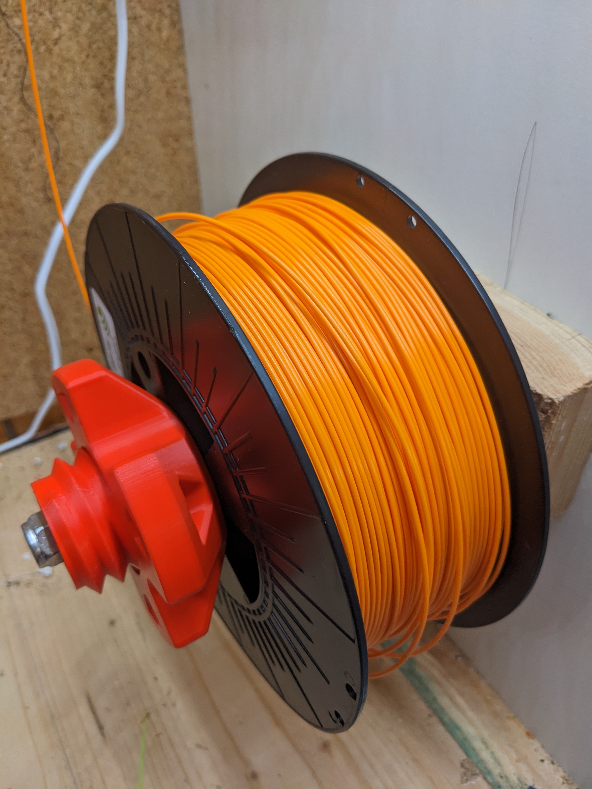

# Spulenhalter
Spool Holder for 10mm thread and 1000ZZ Bearings in openSCAD

i found this beautiful spoolholder https://www.thingiverse.com/thing:2070272 but since my available material
are 1000ZZ bearings and 10mm rods, and also purely, for learning purposes, i am trying to reproduce it in 
openSCAD

## History
1. 2019-07-10 first revision
2. 2020-06-12 changed to A. Schlatters threadlib threads, (much nicer, no need for tapering etc)
3. 2023-06-12 rewrote the threads to be more compliant with my version of A Schlatters version of the library

## Needed to compile :
- Noh's version of threadlib: [Noh's version of A. Schlatter threadlib](https://github.com/nohkumado/threadlib)

## Image gallery:

[V1 prior preparation](images/IMG\_20190725\_125518.jpg)

